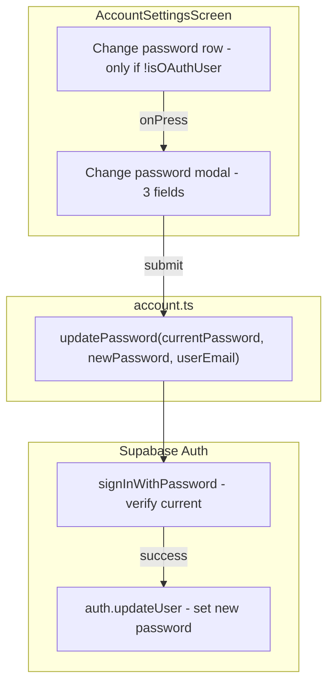

# Change Password Feature Plan (Production-Ready)

## Context

[AccountSettingsScreen.tsx](src/features/profile/screens/AccountSettingsScreen.tsx) has Contact Information, Privacy, and Account Actions. We add a Security section with Change password for email/password users only (hidden for OAuth via `isOAuthUser`).

## Architecture




## Security: Current Password Verification

**Requirement:** Verify current password before changing. Anyone with device access cannot change the password without knowing it.

**Implementation in service:**

1. Call `supabase.auth.signInWithPassword({ email: userEmail, password: currentPassword })` to verify.
2. If error: return `{ error: new Error('Current password is incorrect') }`.
3. If success: call `supabase.auth.updateUser({ password: newPassword })`.

**Note:** `signInWithPassword` will refresh the session. The user stays signed in. No Edge Function needed.

## Session Behavior (Documented)

- **Current device:** Stays signed in after password change (Supabase `updateUser` does not invalidate session).
- **Other devices:** Sessions remain valid until they expire or the user signs out. Supabase does not automatically invalidate other sessions on password change.
- **Future enhancement:** Optional "Sign out other devices" could call `supabase.auth.admin.listUserSessions` + revoke (requires Edge Function with service role).

## Implementation

### 1. Add `updatePassword` to account service

In [src/services/account.ts](src/services/account.ts):

```ts
export async function updatePassword(
  userEmail: string,
  currentPassword: string,
  newPassword: string
): Promise<{ error: unknown }> {
  try {
    const { error: signInError } = await supabase.auth.signInWithPassword({
      email: userEmail,
      password: currentPassword,
    });
    if (signInError) {
      return { error: new Error('Current password is incorrect') };
    }
    const { error } = await supabase.auth.updateUser({ password: newPassword });
    return { error };
  } catch (error) {
    return { error };
  }
}
```

Service needs `userEmail` because we resolve it from `user.email` or private data (AccountSettingsScreen already loads `email`).

### 2. Password strength validation

Add `validatePassword` utility (or inline in screen):

```ts
function validatePassword(password: string): string | null {
  if (password.length < 8) return 'Password must be at least 8 characters';
  if (!/[A-Z]/.test(password)) return 'Password must contain an uppercase letter';
  if (!/[a-z]/.test(password)) return 'Password must contain a lowercase letter';
  if (!/[0-9]/.test(password)) return 'Password must contain a number';
  return null;
}
```

**Note:** SignUpEmailScreen uses `length >= 6`. This plan upgrades to 8+ with complexity for production. If you need parity with signup, consider adding the same validation to signup later.

### 3. Error handling strategy

Add `getPasswordErrorMessage` in the screen or a shared util:

```ts
function getPasswordErrorMessage(error: unknown): string {
  const msg = error instanceof Error ? error.message : String(error ?? '');
  const lower = msg.toLowerCase();
  if (lower.includes('rate limit') || lower.includes('too many')) return 'Too many attempts. Try again later.';
  if (lower.includes('session') || lower.includes('expired') || lower.includes('jwt')) return 'Session expired. Please sign in again.';
  if (msg.includes('Current password is incorrect')) return msg;
  if ((error as { status?: number })?.status === 422) return 'Password does not meet requirements.';
  return 'Failed to change password. Please try again.';
}
```

- **Network failures:** Use existing `useErrorHandler` / `handleApiError` with retry (or show `changePasswordError` with "Retry" in modal).
- **Session expiry:** Show "Session expired. Please sign in again." and optionally sign out / redirect to auth.
- **Rate limiting:** Show cooldown message.

### 4. Success feedback

Use `ErrorHandlerContext.showServerError` only for errors. For success, use a non-error toast or Alert:

- **Option A:** `Alert.alert('Success', 'Your password has been updated.')` - simple, consistent with existing Alerts.
- **Option B:** Add a success toast (project has `ErrorToast` for errors; no generic success toast yet). Creating a `SuccessToast` would be a separate task.

**Recommendation:** Use `Alert.alert('Success', 'Your password has been updated.')` for MVP. Upgrade to success toast later if desired.

### 5. Accessibility

Add to password `TextInput`s in the modal:

- `accessibilityLabel`: e.g. "Current password", "New password", "Confirm new password"
- `accessibilityHint`: e.g. "Required to verify your identity before changing"
- Announce errors to screen readers (ensure `changePasswordError` is associated with the form, e.g. via `accessibilityLiveRegion` or placing error text immediately after inputs)

### 6. Extend AccountSettingsScreen

**State:**

- `changePasswordModalVisible`
- `changePasswordCurrent`
- `changePasswordNew`
- `changePasswordConfirm`
- `changingPassword`
- `changePasswordError`

**UI:**

- Security section (between Privacy and Account Actions) with "Change password" row, visible only when `!isOAuthUser(user)`.
- Modal with:
  - Current password (secure)
  - New password (secure)
  - Confirm new password (secure)
  - Error text
  - Cancel / Update

**Handlers:**

- `handleChangePasswordPress`: open modal, reset all fields and error.
- `handleChangePasswordClose`: close if not loading.
- `handleChangePasswordSubmit`:
  1. Validate current password non-empty.
  2. Validate new password with `validatePassword`.
  3. Validate new === confirm.
  4. Resolve `userEmail` from `user.email` or `email` state (from private data).
  5. Call `updatePassword(userEmail, changePasswordCurrent, changePasswordNew)`.
  6. On success: close modal, clear state, `Alert.alert('Success', 'Your password has been updated.')`.
  7. On error: `setChangePasswordError(getPasswordErrorMessage(error))`.

### 7. Files changed


| File                                                                                                             | Changes                                                                                                 |
| ---------------------------------------------------------------------------------------------------------------- | ------------------------------------------------------------------------------------------------------- |
| [src/services/account.ts](src/services/account.ts)                                                               | Add `updatePassword(userEmail, currentPassword, newPassword)`                                           |
| [src/features/profile/screens/AccountSettingsScreen.tsx](src/features/profile/screens/AccountSettingsScreen.tsx) | Security section, Change password row, modal, state, handlers, validation, error mapping, accessibility |


### 8. Testing scenarios

- Change password with correct current password
- Reject incorrect current password
- Reject weak new password (length, complexity)
- Reject mismatched new/confirm
- Handle network interruption (retry in modal or via error handler)
- Verify session stays valid on current device
- Test with very long passwords (e.g. >100 chars) - Supabase typically allows up to 72 for bcrypt
- Verify accessibility with VoiceOver/TalkBack

## Scalability / Production checklist


| Aspect                                             | Addressed                                   |
| -------------------------------------------------- | ------------------------------------------- |
| Current password verification                      | Yes - signInWithPassword before updateUser  |
| Password strength (8+ chars, upper, lower, number) | Yes                                         |
| Error handling (rate limit, session, 422)          | Yes - getPasswordErrorMessage               |
| Success feedback                                   | Yes - Alert on success                      |
| Accessibility                                      | Yes - accessibilityLabel, accessibilityHint |
| Multi-device / session invalidation                | Documented; optional future enhancement     |
| OAuth users                                        | Hidden - no change password for OAuth       |


## Todos

- Add `updatePassword(userEmail, currentPassword, newPassword)` to `src/services/account.ts`
- Add Security section, Change password row, modal, state, handlers, `validatePassword`, `getPasswordErrorMessage`, and accessibility to `AccountSettingsScreen`

